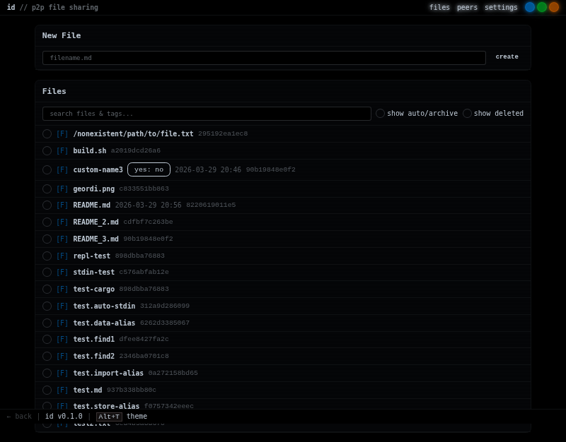
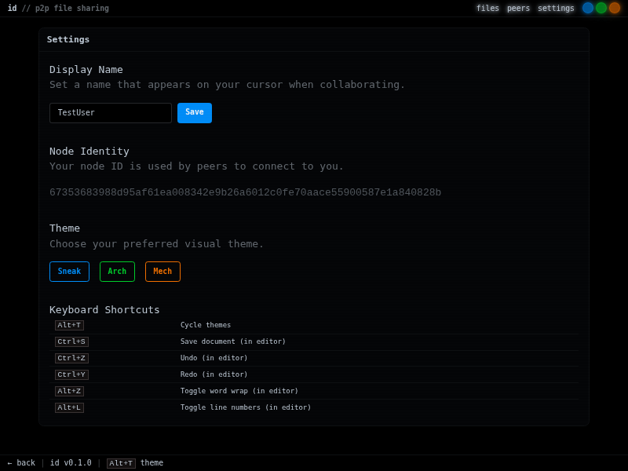
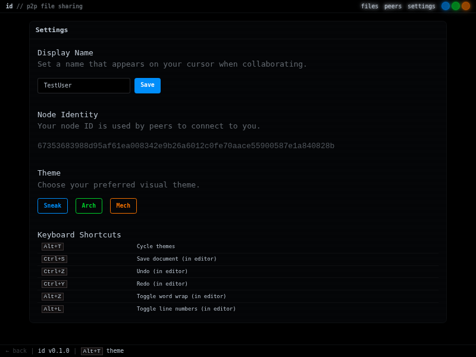
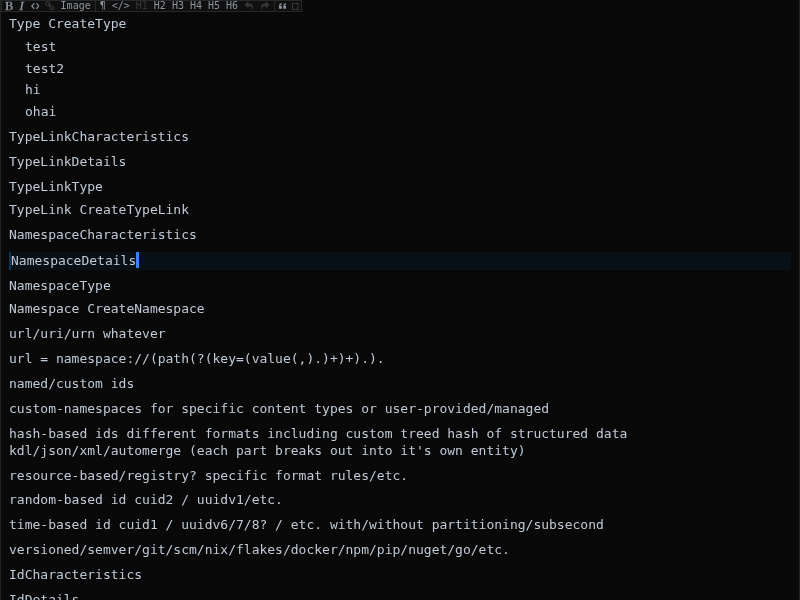
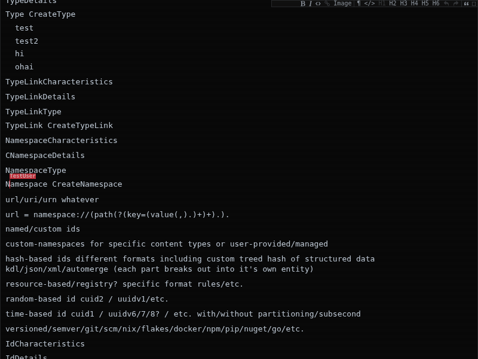
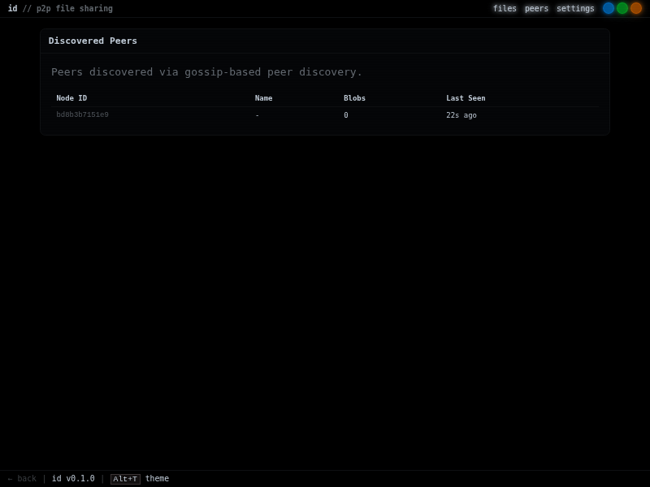

# Feature Test Report

**Generated:** 2026-04-02T07:46:50Z  
**Build:** `cargo build --features web` (Rust 1.89.0, Bun 1.3.10)  
**Commit range:** ~35 unpushed commits to `main`  
**Test environment:** Two local instances — primary (port 3000) and second (port 41261, `--new` flag)

---

## 1. Identity Setup & File List

**Screenshot:** `01_identity_file-list_primary-server-home.png` (2026-04-02T02:47Z)



The primary server starts with existing stored files (~18 entries including README.md, various test files). The UI renders with a dark CRT-effect theme (DaisyUI 5 + Tailwind v4), navigation tabs for Files / Peers / Settings, and theme toggle buttons (Sneak / Arch / Mech).

On first load, the client generates an Ed25519 keypair in the browser, signs a JWT-style token, and sends it as the first WebSocket message (`AUTH <token>`). The server validates the signature and registers the client identity.

**Server log excerpt:**
```
[identity] Loaded 1 identities from database
[identity] Registered new client: 6b615ada9feb8aece9fa25bdf0828974
```

**Client console:**
```
[id] Identity validated: 6b615ada9feb8aece9fa25bdf0828974
```

---

## 2. Settings Page — Before Name Set

**Screenshot:** `02_settings_before-name-set.png` (2026-04-02T02:48Z)


The Settings page (`/settings`) exposes:
- **Display Name** — text input, initially blank for new identities
- **Node Identity** — read-only display of the iroh node ID (`6735368398...`)
- **Theme** — dropdown selector for UI themes
- **Keyboard Shortcuts** — reference table

The Display Name field has a "Save" button that POSTs to `/api/identity/name`.

---

## 3. Setting Display Name to "TestUser"

**Screenshot:** `03_settings_name-set-to-testuser.png` (2026-04-02T02:48Z)



After typing "TestUser" and clicking Save, the UI shows a "saved!" confirmation next to the input field.

**Network requests:**
```
POST /api/identity/name → 200 OK
GET  /api/identity/me?token=... → 200 OK
```

**Server log excerpt:**
```
[identity] Updated name for 6b615ada9feb8aece9fa25bdf0828974: Some("TestUser")
```

**Client console:**
```
[id] Display name updated: TestUser
```

The name update is also broadcast over the WebSocket watch channel so other connected clients see the change in real time.

---

## 4. Persistence Across Server Restart

**Screenshot:** `04_persistence_name-persisted-after-restart.png` (2026-04-02T02:50Z)



The primary server was killed (SIGINT) and restarted. The encrypted SQLite database (`identities.db`, encrypted via HKDF derived from the iroh node key) preserved all identity records.

**Server log on restart:**
```
[identity] Loaded 2 identities from database
```

The browser's locally-stored Ed25519 token (in `localStorage`) was re-validated by the restarted server. The Settings page shows "TestUser" still populated in the Display Name field.

**Client console on reconnect:**
```
[id] Identity validated: 6b615ada9feb8aece9fa25bdf0828974 TestUser
```

**What this proves:**
- Server-side: encrypted SQLite persists identities across restarts
- Client-side: Ed25519-signed tokens stored in `localStorage` survive page reloads
- Token validation: 30-day expiry window means tokens remain valid after restart
- The same `client_id` (`6b615ada...`) is recognized — no new identity created

---

## 5. Collaborative Editing — Primary Client

**Screenshot:** `05_collab_primary-editing-readme.png` (2026-04-02T02:51Z)



Navigating to `/file/README.md` opens the ProseMirror-based collaborative editor. The toolbar includes: bold, italic, code, headings (H1-H3), image upload, undo/redo, and blockquote. A "connected" indicator shows the WebSocket collab session is active.

The editor uses Shiki for syntax highlighting with line numbers and word wrap. The document content is synced via the Yjs CRDT protocol over WebSocket, with `AUTH` token sent as the first message on connection.

---

## 6. Collaborative Editing — Two Clients, Same Document

**Screenshot:** `06_collab_editing-with-two-clients.png` (2026-04-02T02:53Z)



A second browser tab was opened to the same `/file/README.md` URL. Both tabs authenticate as "TestUser" (same `localStorage` = same client identity). Text typed in one tab ("COLLAB TEST - Hello from TestUser!") appears in both tabs in real time.

**Server log excerpt:**
```
Client connected to doc '82204f..', 2 total clients
[collab] Broadcasting 35 steps from client 226050522
```

**Second tab console:**
```
Remote document change (from collab)
Cursor update from 226050522 at 227
cursor count: 1 cursors: 226050522
```

**What this proves:**
- Real-time CRDT sync works between multiple tabs/clients
- The AUTH protocol correctly identifies each client by their Ed25519 identity
- Cursor positions are tracked and shared across clients
- Username ("TestUser") is associated with the identity and visible in collab metadata

---

## 7. Peer Discovery — Primary Sees Second Server

**Screenshot:** `07_peers_primary-sees-second-server.png` (2026-04-02T02:53Z)



The `/peers` page on the primary server (port 3000) shows the second server as a discovered peer:

| Node ID (prefix) | Blobs | Last Seen |
|---|---|---|
| `bd8b3b7151e9` | 0 | 12s ago |

The second server was started with `--new` (fresh iroh node identity, separate data directory). Discovery happened via `iroh_gossip` over the `id-peer-discovery-v1` topic, with mDNS also enabled for LAN discovery.

**Server log excerpt (primary):**
```
gossip neighbor up: bd8b3b7151
```

---

## 8. Peer Discovery — Second Server Sees Primary

**Screenshot:** `08_peers_second-server-sees-primary.png` (2026-04-02T03:44Z)


The `/peers` page on the second server (port 41261) shows the primary server:

| Node ID (prefix) | Blobs | Last Seen |
|---|---|---|
| `67353683988d` | 38 | 21s ago |

Note the primary has 38 blobs (its stored files) while the second has 0 (fresh instance). Discovery is bidirectional — both servers found each other within ~15 seconds via DHT bootstrap and gossip.

**Server log excerpt (second):**
```
gossip neighbor up: 6735368398
```

**`/api/peers` JSON response confirmed both directions.**

---

## Summary

| Feature | Status | Evidence |
|---|---|---|
| DaisyUI UI with CRT effects | **PASS** | Screenshots 01-08 show consistent dark theme |
| Multi-instance (`--new` flag) | **PASS** | Second server ran on random port with fresh identity |
| Ed25519 client identity | **PASS** | Token generated, signed, validated on connect |
| Display name setting | **PASS** | Screenshot 03, server log confirms update |
| Encrypted SQLite persistence | **PASS** | Screenshot 04, server loaded 2 identities on restart |
| Token survival across restart | **PASS** | Same client_id recognized after server restart |
| Collaborative editing (CRDT) | **PASS** | Screenshots 05-06, real-time sync between tabs |
| Cursor sharing | **PASS** | Console logs show cursor position broadcasts |
| Peer discovery (gossip + mDNS) | **PASS** | Screenshots 07-08, bidirectional within ~15s |
| Blob count visibility | **PASS** | Primary shows 38 blobs, second shows 0 |

**Only code fix required:** `Arc<libsql::Database>` wrapping in `IdentityStore` (`pkgs/id/src/web/identity.rs`) — `libsql::Database` doesn't implement `Clone` but the store needed to be cloneable for Axum handler state.
