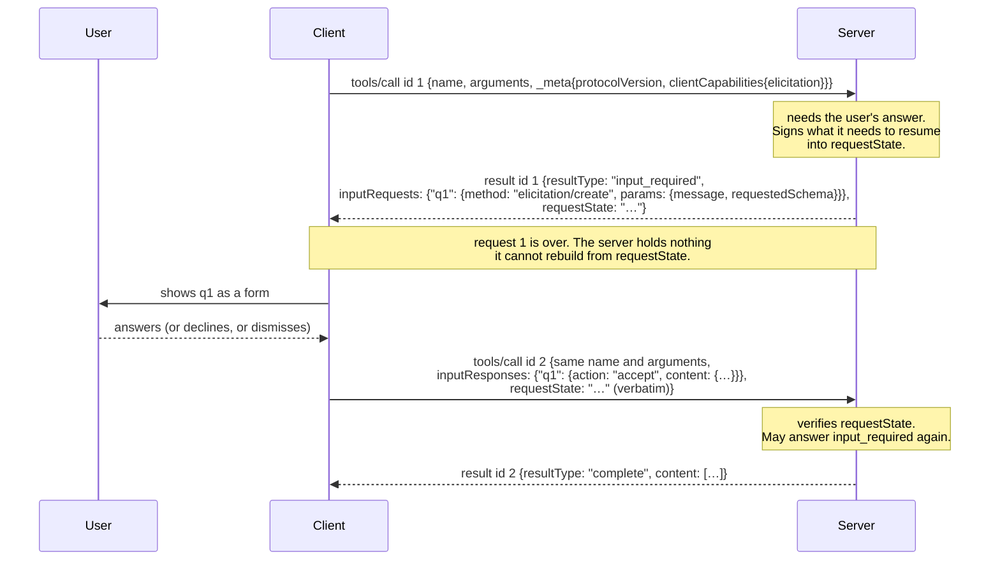
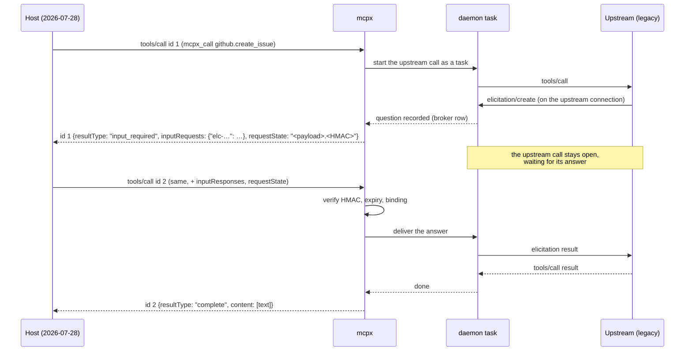

# What `input_required` is

```
created:      2026-09-30T08:00:00-05:00
last-updated: 2026-09-30T08:00:00-05:00
increment:    1
status:       standard
tags:         area:compare, area:protocol
description:  the 2026-07-28 way a server asks its client for something,
              in plain words, with the sequence, and what mcpx does with it
              in each direction.
```

## In plain words

Sometimes a server cannot finish a request without something only the client
has: the user's answer to a question, a completion from the client's model, or
the list of folders the client is working in.

Until 2025-11-25 the server asked by sending the client a request of its own
(`elicitation/create`, `sampling/createMessage`, `roots/list`) over the same
connection, while the client's original request was still open. That needs a
connection that stays open and a server that remembers who is on the other end.

2026-07-28 removed both. So the server now **answers early instead of
asking**. It replies to the client's request with a result that says, in
effect, *"not finished; first tell me these things, then send me the same
request again."* That reply is `resultType: "input_required"`. It carries:

- `inputRequests`: what the server needs, as a map from a key the server picks
  to a request-shaped object (`{method, params}`). Only three kinds are
  allowed: `elicitation/create`, `sampling/createMessage` and `roots/list`
  (`2026-07-28/basic/patterns/mrtr.mdx:229`).
- `requestState`: an opaque string the client must hand back unchanged
  (`2026-07-28/basic/patterns/mrtr.mdx:130`). The server puts whatever it
  needs to pick up where it left off in here, so it does not have to remember
  anything itself.

The client gets the answers (asks the user, runs its model, lists its roots)
and **sends the original request again** with a new JSON-RPC id, adding
`inputResponses` (the same keys, each with its answer) and the `requestState`
exactly as received (`2026-07-28/basic/patterns/mrtr.mdx:251-256`). The server
may finish, or may ask again; nothing limits the number of rounds
(`2026-07-28/basic/patterns/mrtr.mdx:247`).

The specification calls this pattern Multi Round-Trip Requests (MRTR). It
applies to exactly three client requests: `tools/call`, `prompts/get` and
`resources/read` (`2026-07-28/basic/patterns/mrtr.mdx:182-192`). The type is
`InputRequiredResult` (`schema/2026-07-28/schema.ts:584-595`), and the retry
fields are `InputResponseRequestParams` (`schema/2026-07-28/schema.ts:600-609`).



## The rules that are easy to miss

- **The server must not ask for something the client did not declare.** No
  `elicitation/create` in `inputRequests` unless *this request's*
  `clientCapabilities` includes `elicitation`
  (`2026-07-28/basic/patterns/mrtr.mdx:246`). If the request cannot finish
  without it, the answer is `-32021` MissingRequiredClientCapability
  (`2026-07-28/basic/index.mdx:387-392`), not an unanswerable question.
- **`requestState` is attacker-controlled.** It passes through the client, so
  the server must integrity-protect anything in it that affects authorization
  or logic (HMAC or AEAD) and reject anything that fails verification. It
  should bind the principal, a short expiry and the originating method plus a
  digest of its parameters. Single use needs server-side enforcement
  (`2026-07-28/basic/patterns/mrtr.mdx:232-243`).
- **The retry is a new request.** It gets a new id
  (`2026-07-28/basic/patterns/mrtr.mdx:256`), and `inputResponses` and
  `requestState` apply to that retry only, never to other requests in flight
  (`2026-07-28/basic/patterns/mrtr.mdx:257`).
- **At least one of the two fields must be present**
  (`2026-07-28/basic/patterns/mrtr.mdx:245`). `requestState` alone means
  "retry when ready"; the client may do so immediately
  (`2026-07-28/basic/patterns/mrtr.mdx:251-253`).
- **The server must not assume the client will come back**
  (`2026-07-28/basic/patterns/mrtr.mdx:247`). Whatever it started has to cope
  with never being resumed.
- **Answers cannot be errors.** `InputResponse` has no error variant, so a
  client that cannot produce one answer has no way to say so except by leaving
  the key out. The server should then ask again rather than fail
  (`2026-07-28/basic/patterns/mrtr.mdx:266-267`). The specification leaves
  this gap unstated; the [register](register/mrtr.md) records it.
- **Tasks use a different road.** Under the tasks extension, input needed
  mid-task is exposed in `tasks/get` and answered with `tasks/update`, not by
  retrying the original request (`seps/2663-tasks-extension.md:346`, `:592`).

## What mcpx does with it

mcpx is in the middle, so it meets `input_required` from both sides. Status at
`05c78b2`.

### mcpx as the server: a modern host, a legacy upstream

The common case. The host speaks 2026-07-28, and the upstream server is legacy
and asks by sending `elicitation/create` on its own connection. mcpx turns one
into the other:



- **The upstream call runs as a daemon task**, because the host's request has
  already returned by the time the answer exists
  (`internal/mcpserver/ask.go:110-121`). The task *is* server-side state. The
  specification allows it, since `requestState` only has to name it safely.
  mcpx is one local process, so the pattern's motivation, avoiding shared
  storage across server instances (`2026-07-28/basic/patterns/mrtr.mdx:30-31`),
  does not apply to it.
- **`requestState` is `base64(payload).HMAC-SHA256`** with a key generated per
  process and never persisted (`internal/mcpserver/state.go:25-51`). The
  payload is `{"c": <call id>, "b": <binding>, "e": <expiry>}`
  (`internal/mcpserver/state.go:47-51`). The expiry is `proto.stateTTL`, 30m.
- **The binding is the `Mcp-Session-Id`**, and that is the problem. 2026-07-28
  has no sessions, so a conformant client has no binding. The comment says
  such a question "goes back to the broker"
  (`internal/mcpserver/ask.go:203-206`). What happens instead is that the loop
  `continue`s without waiting, counts a round each time, and after
  `proto.askRounds` (8) abandons the upstream call and answers
  `-32603 "tools/call was still asking for input after 8 rounds"`
  (`internal/mcpserver/ask.go:195-209`). Reproduced on the wire; it takes about
  40 ms. A client that keeps the `Mcp-Session-Id` mcpx mints on
  `server/discover` gets the flow above, and a retry without that header is
  refused "this requestState belongs to another session".
- **The binding is not to the request.** The specification's replay guidance is
  principal, expiry, and method plus parameter digest. mcpx binds call, session
  and expiry. A `requestState` attached to a different `tools/call` on the same
  session was not rejected in the recorded session.
- **The finished result is text.** Whatever the upstream returned, a call that
  went through a question comes back as one text block (plus `isError`); a
  `prompts/get` comes back as one user text message
  (`internal/mcpserver/ask.go:268-296`).
- **The question is passed through as the upstream asked it.** The
  `inputRequests` value is the upstream's `params` verbatim, including
  2025-11-25-only fields such as `elicitationId` when the upstream sent them.
- **A legacy host is asked on the wire instead**: `elicitation/create` goes out
  on the POST's own SSE stream (HTTP) or down the pipe (stdio), and the answer
  arrives as a separate POST routed by session (`docs/protocol.md` §3.2).

### mcpx as the client: a modern upstream

When an upstream answers `input_required`, mcpx's client resolves each input
request through the same function that answers a legacy server's
`elicitation/create` (the broker), then retries with a new id, the answers in
`inputResponses` and `requestState` verbatim. It never adds a `requestState`
that was not given (`internal/mcpclient/modern.go:156-189`,
`internal/mcpclient/client.go:653-677`). It gives up after `elicit.inputRounds`
(8) rounds (`internal/defaults/defaults.json:66`). That side follows the
client rules. In practice it is unreachable against a conformant modern server
at `05c78b2`, because discovery reads the wrong field
([stateless.md](stateless.md#the-answer)).

### Why this matters for mcpx

`input_required` is the only way a 2026-07-28 server can ask anything, and it
is how a proxy has to carry an upstream's question to the one party that can
answer it: the host's user. Everything else about the modern era is
bookkeeping. This one decides whether a credential prompt from a server three
hops away reaches a human or times out in a broker nobody is watching.
